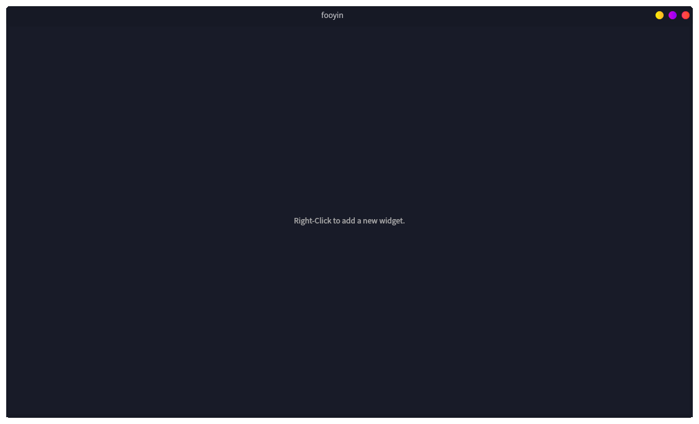
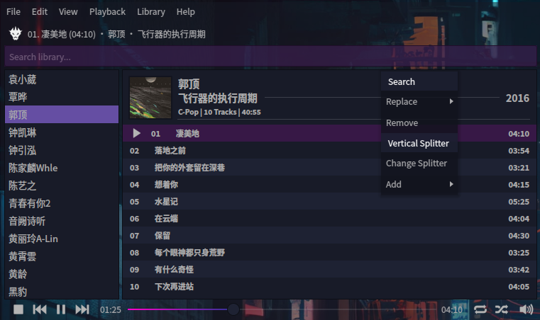

# Fooyin
Fooyin is a customisable music player for linux. It has not yet reached a stable release so bugs and breaking changes should be expected.

<p align="center">

</p>

In addition to being a music player, Fooyin also includes a *Layout Editing Mode*, allowing custom user layouts.

<p align="center">

</p>

## Features
- [x] Fully customisable layout
- [x] Add/Remove music libraries
- [x] Filter and search collection
- [x] Plugin system
- [ ] Full playlist support
- [ ] Tag editing
- [ ] FFmpeg backend
- [ ] Visualisations
- [ ] Lyrics support - embedded & lrc + enhanced lrc
- [ ] Last.fm integration
- [ ] Discogs integration
- [ ] Lyric querying

## Dependencies
Fooyin is built with and requires:
* Qt6
* Taglib (1.12)
* Libmpv (mpv)

## Setup
After you have installed the required dependencies, use your terminal to issue the following commands:

```
git clone git@github.com:ludouzi/fooyin.git
cd fooyin
mkdir build
cd build
cmake ..
make -j4
sudo make install
```
