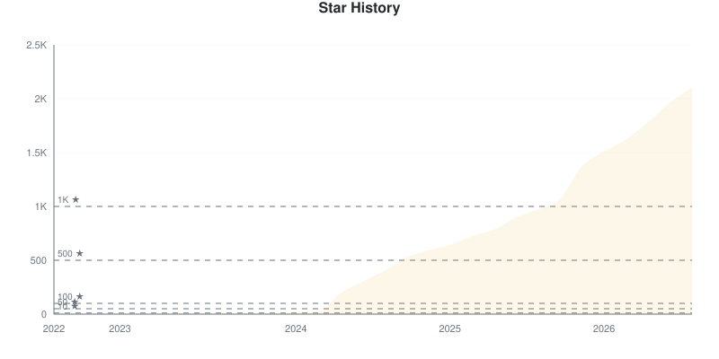
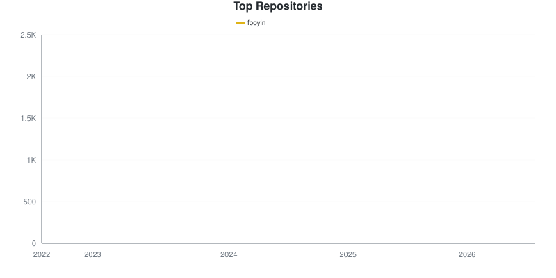
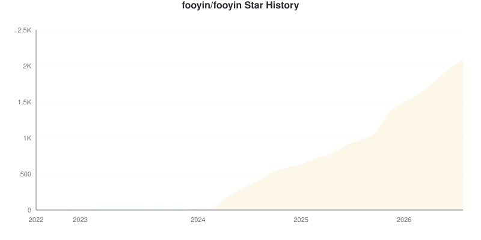
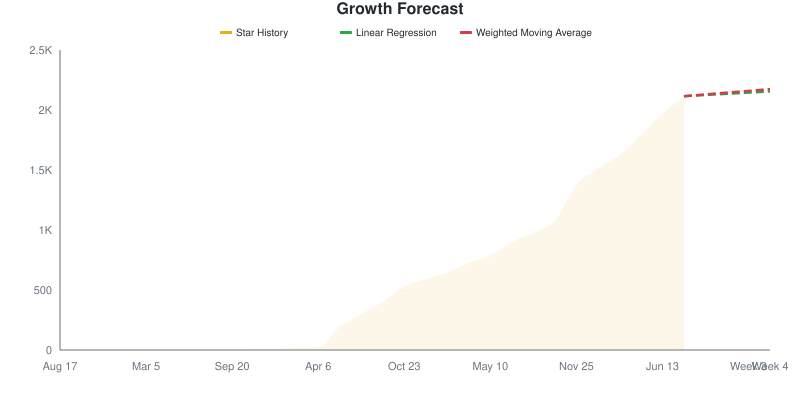

# Star Tracker Report

**2026-08-07** | Total: **2140 stars** | Change: **+5**

> Compared to snapshot from 2026-08-06

## 📈 Star Trend

### By Repository

Individual Repository Charts

#### fooyin/fooyin

## Repositories

| Repositories | Stars | Change | Trend |
|:-----------|------:|-------:|:-----:|
| [fooyin/fooyin](https://github.com/fooyin/fooyin) | 2140 | +5 | ⬆️ |

## Summary

- **Stars gained:** 5
- **Stars lost:** 0
- **Net change:** +5

## 👤 New Stargazers

5 new stargazers since last run

fooyin/fooyin (5 new)

-  [martsum](https://github.com/martsum): starred on 2026-08-07
-  [dmfcat](https://github.com/dmfcat): starred on 2026-08-06
-  [notseriouss](https://github.com/notseriouss): starred on 2026-08-06
-  [markoseppanen](https://github.com/markoseppanen): starred on 2026-08-06
-  [SleepyDogeYuan](https://github.com/SleepyDogeYuan): starred on 2026-08-06

## 🔮 Growth Forecast

**Aggregate Forecast**

| Method | Week 1 | Week 2 | Week 3 | Week 4 |
|:---|---:|---:|---:|---:|
| Linear Regression | 2150 | 2160 | 2170 | 2180 |
| Weighted Moving Average | 2155 | 2170 | 2185 | 2200 |

### By Repository

fooyin/fooyin

**fooyin/fooyin**

| Method | Week 1 | Week 2 | Week 3 | Week 4 |
|:---|---:|---:|---:|---:|
| Linear Regression | 2150 | 2160 | 2170 | 2180 |
| Weighted Moving Average | 2155 | 2170 | 2185 | 2200 |

---
*Generated by [GitHub Star Tracker](https://github.com/fbuireu/github-star-tracker) on 2026-08-07T02:35:53.184Z*

*Made with 🤘 by [Ferran Buireu](https://github.com/fbuireu)*

